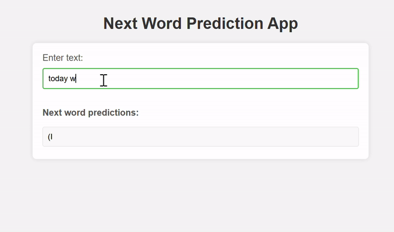

# Next Word Prediction App

This is a simple web application built with Flask and powered by the GPT-2 model from Hugging Face. The app predicts the next words based on the input text you provide.

## Features
- Predicts the next words using GPT-2 model.
- Displays the predictions in real-time as you type.
- Interactive and responsive UI for a smooth experience.

## Requirements
- Python 3.x
- Flask
- Hugging Face's `transformers` library
- PyTorch

## Installation

1. Clone this repository to your local machine:

    ```bash
    git clone https://github.com/yourusername/next-word-prediction.git
    ```

2. Change to the project directory:

    ```bash
    cd next-word-prediction
    ```

3. Create a virtual environment (optional but recommended):

    ```bash
    python -m venv venv
    ```

4. Activate the virtual environment:

    - On Windows:
    
    ```bash
    venv\Scripts\activate
    ```

    - On macOS/Linux:
    
    ```bash
    source venv/bin/activate
    ```

5. Install the required dependencies:

    ```bash
    pip install -r requirements.txt
    ```

    If `requirements.txt` is not available, install them manually:

    ```bash
    pip install flask torch transformers
    ```

## Usage

1. Start the Flask server by running the following command:

    ```bash
    python app.py
    ```

2. Open your browser and visit `http://127.0.0.1:5000/` to use the Next Word Prediction app.

3. Type text in the input field, and the app will show predictions for the next words as you type.

## How It Works

- **Backend**: The app uses Flask as the backend framework. When the user types text in the input field, the text is sent to the server using an AJAX request.
- **Model**: The GPT-2 model, loaded from Hugging Face, generates predictions based on the input text.
- **Prediction**: The model predicts the next words, which are returned and displayed on the frontend.

## Customization

- You can change the number of predicted words by modifying the `num_predictions` parameter in the `predict_next_words` function in `app.py`.
- You can experiment with different models by changing the `model_name` in the code (e.g., `gpt2-medium`, `gpt2-large`, etc.).

## Contributing

If you'd like to contribute to this project, feel free to open a pull request or raise an issue with your suggestions or improvements.

## License

This project is licensed under the MIT License - see the [LICENSE](LICENSE) file for details.

## Acknowledgements

- Hugging Face for providing the pre-trained GPT-2 model.
- Flask for the lightweight web framework.
- PyTorch for the model inference.


## Demo


